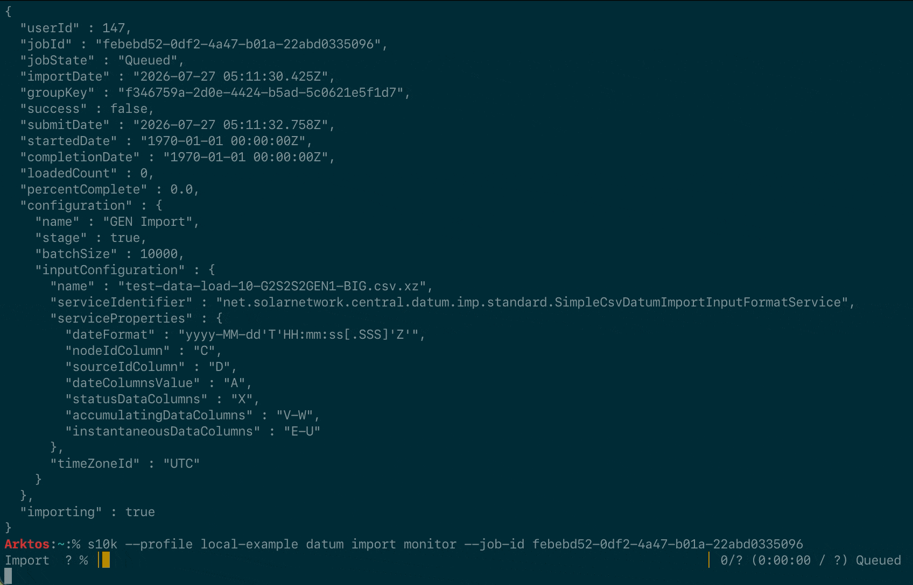

# Datum Imports Monitor

Track the progress of a datum import job.

## Usage

```
s10k datum imports monitor
	-j=<jobId>
	[-mode=<displayMode>]
```

## Options

<div markdown="1" class="options-explicit-col-widths">

| Option | Long Version | Description |
|:-------|:-------------|:------------|
| `-j=` | `--job-id=` | the ID of the job to monitor |
| `-mode=` | `--display-mode=` | the format to display the data as, one of `CSV`, `JSON`, or `PRETTY`; defaults to `PRETTY` |

</div>

## Output

For pending jobs, a progress indicator showing the overall progress of the import job. Once complete, the final job status
information will be shown.

<figure markdown>
  {width=848 loading=lazy}
</figure>


## Examples

=== "View datum import"

	```sh
	s10k datum imports monitor --job-id 49a2f730-0000-0000-0000-233d085c799a
	```

=== "View datum import (shortcut)"

	You can use `imp` instead of `imports`:

	```sh
	s10k datum imp monitor --job-id 49a2f730-0000-0000-0000-233d085c799a
	```
